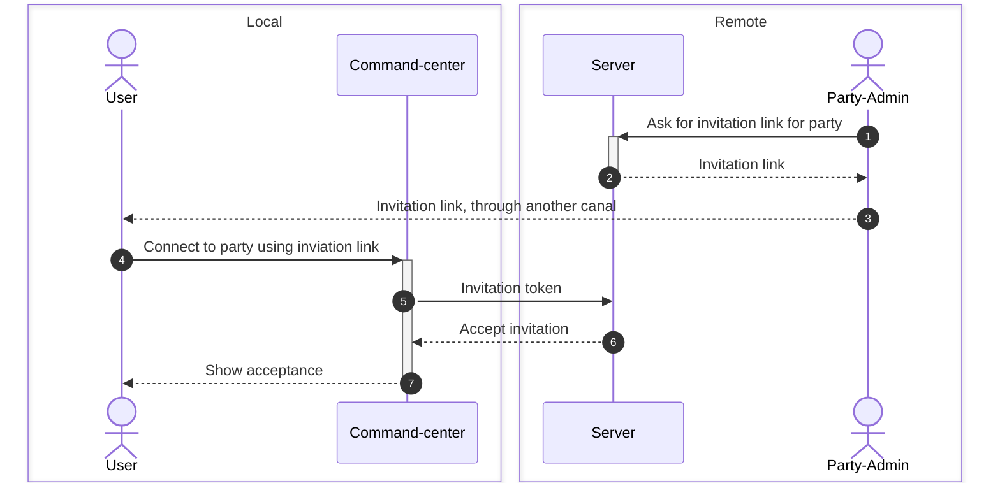
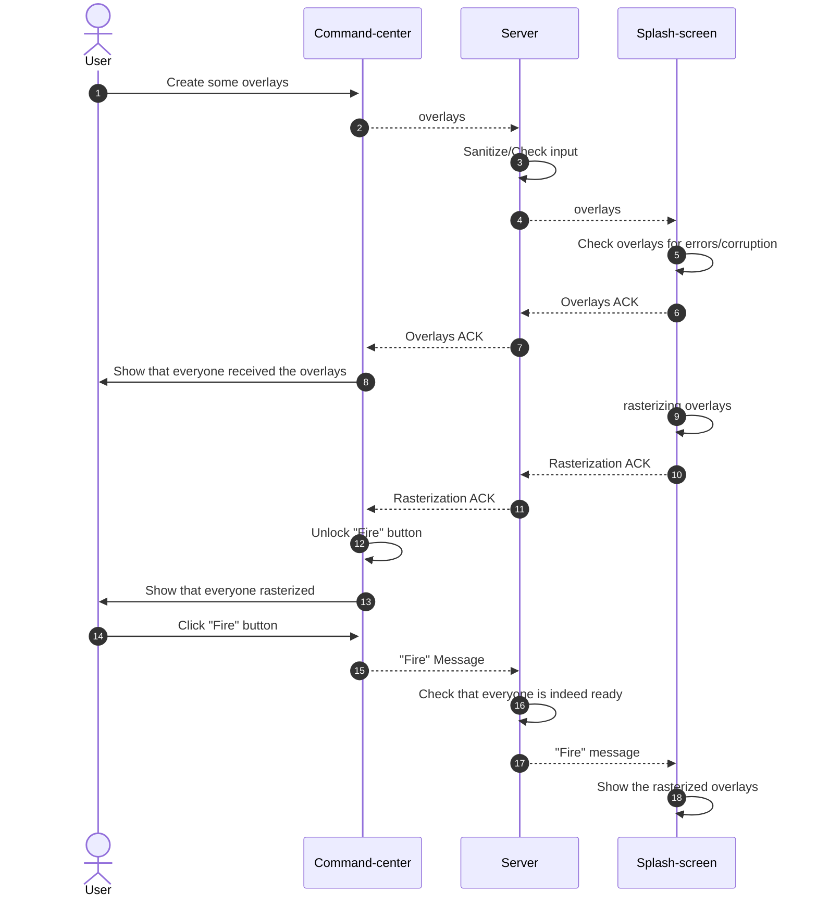

friendlyfire/\
│\
├── shared/         # Share protocol/messages\
│\
├── command-center/ # Sender of media, main interaction point for the software\
├── server/         # Websocket relay server\
└── splash-screen/  # Receiver of media, will show media in a splash-screen manner\
│\
└── resources/      # images, assets, icons

AVIF format is unsupported for the splash-screen
I think this will be resolved by [this pr](https://github.com/image-rs/image/issues/2621)
In the mean time, the standard image codec will be PNG I think

Overlay : A layer of rgba that can be composited into a Frame
Frame : Structure drawable onto a Window
Compositor : How to blend multiple Overlay into a Frame
Window : Handles the Window (duh) and the rendering (via OS-level APIs)

**Joining a party**, much like Discord

**Sending Overlays**

